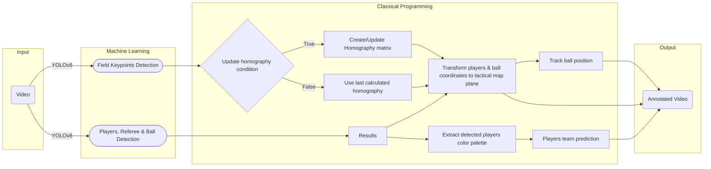

# AI-Powered Football Tactical Map

### Overview
FootballTacticalMap is a Streamlit-based web application that leverages computer vision and deep learning to analyze football tactics from tactical camera footage. 
It detects players, predicts team affiliations, and overlays tactical insights onto a football pitch map. The application provides valuable insights to assist in decision-making processes for coaches, analysts, and enthusiasts.

## 📌 Features
- **Object Detection:** Identify players, referees, and the ball within match footage.
- **Team Classification:** Assign players to their respective teams based on predefined team colors.
- **Tactical Mapping:** Generate a tactical map representation of player positions and movements.
- **Ball Tracking:** Monitor and visualize the ball's trajectory throughout the match.

## 🗂 Project Structure
```
📂 FootballTacticalMap/
├── 📄 app.py                          # Main Streamlit app
├── 📄 README.md
├── 📄 requirements.txt
├── 📂 annotation/                     # Annotation functions and drawing utilities
│   └── 📄 annotation.py
├── 📂 assets/                         # Static assets (images, test video)
│   ├── 📄 tactical_map.jpg
│   └── 📄 test_vid.mp4
├── 📂 config/                         # YAML config files and label mappings
│   ├── 📄 config pitch dataset.yaml
│   ├── 📄 config players dataset.yaml
│   ├── 📄 environment.yml
│   └── 📄 pitch map labels position.json
├── 📂 coordinate_transformer/
│   └── 📄 coordinate_transformer.py   # Converts image coordinates to pitch coordinates
├── 📂 Detection/
│   └── 📄 detection.py                # YOLO-based object detection
├── 📂 models/                         # Pre-trained model weights
│   ├── 📄 Field_Keypoints.pt
│   └── 📄 Players.pt
├── 📂 outputs/                        # Generated output videos
│   ├── 📄 Demo_result.mp4
│   ├── 📄 detect_1.mp4
│   └── 📄 detect_2.mp4
├── 📂 team_prediction/
│   └── 📄 team_prediction.py         # Player team prediction logic
└── 📂 .venv/                         # Python virtual environment
```

## 🛠️ Installation
**1. Clone the repo**
```bash
git clone https://github.com/PyaMaster/FootballTacticalMap.git
cd FootballTacticalMap
```
**2. Create and activate a virtual environment**
```bash
python -m venv .venv
source .venv/bin/activate  # On Windows: .venv\Scripts\activate
```
**3. Install dependencies**
```bash
pip install -r requirements.txt
```
**4. (Optional) Setup environment with YAML**
```bash
conda env create -f config/environment.yml
conda activate footballtacticalmap
```

## 🚀 Run the Application:
**1. Run the app**
```bash
streamlit run app.py
```
**2. Upload a video**
  - Use the sidebar to upload your `.mp4`, `.mov`, `.avi`, or similar file.
  - Works only with tactical camera footage (full field view).

**3. Analyze**
  - The app will detect players, classify their teams, and plot movements on a tactical pitch map.
  - The application's workflow involves processing input video footage to detect objects (players, referees, ball), classify teams, generate tactical maps, and track ball movements. This process is visualized in the workflow diagram below.


## 🎯 Use Cases
- Tactical analysis for coaches
- Visual storytelling in football journalism
- Training content creation
- Fan content and match previews

## 📌 Notes
- The detection module uses Ultralytics `YOLOv8`.
- Team prediction is custom-trained for tactical camera perspectives.
- The system may not work correctly with broadcast footage or zoomed-in views.
- I highly recommend replacing the current pretrained models with more performant alternatives to improve the accuracy and robustness of the overall system.

## 🙌 Acknowledgements
This project is inspired by and builds upon the work of Aditya, whose repository can be found [here](https://github.com/Hmzbo/Football-Analytics-with-Deep-Learning-and-Computer-Vision). His contributions have been instrumental in shaping the direction and development of this application.

## 📜 License 
This project is licensed under the MIT License. See the [LICENSE](/LICENSE.txt) file for details.
